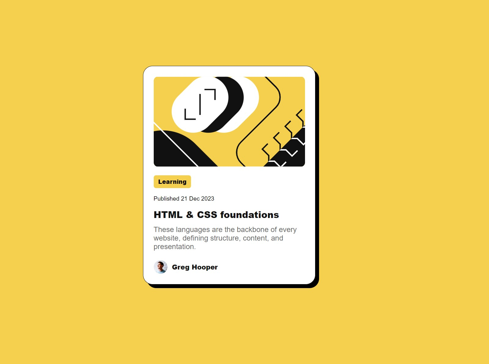

# Frontend Mentor - Blog preview card solution

This is a solution to the [Blog preview card challenge on Frontend Mentor](https://www.frontendmentor.io/challenges/blog-preview-card-ckPaj01IcS). Frontend Mentor challenges help you improve your coding skills by building realistic projects. 

## Table of contents

- [Overview](#overview)
  - [The challenge](#the-challenge)
  - [Screenshot](#screenshot)
  - [Links](#links)
- [My process](#my-process)
  - [Built with](#built-with)
  - [Useful resources](#useful-resources)
- [Author](#author)

## Overview

### The challenge

Users should be able to:

- See hover and focus states for all interactive elements on the page

### Screenshot

### Links

- Solution URL: [Github repo](https://github.com/pierrettemugisha/fm-blog-preview-card)
- Live Site URL: [Live site URL](https://fm-blog-preview-card.vercel.app/)

## My process

### Built with

- Semantic HTML5 markup
- CSS custom properties

### Useful resources

- [W3 Schools - HTML Tutorial](https://www.w3schools.com/html/) - This helped me for basic HTML. This is my go to resource for all things development. It's a good start for learning the basics of a programing language in general.
- [W3 Schools - CSS Tutorial](https://www.w3schools.com/css/default.asp) - This helped me for CSS. I find CSS very hard. This is will still be my go-to resource if I am struggling with something else.

## Author

- Frontend Mentor - [@pierrettemugisha](https://www.frontendmentor.io/profile/pierrettemugisha)
